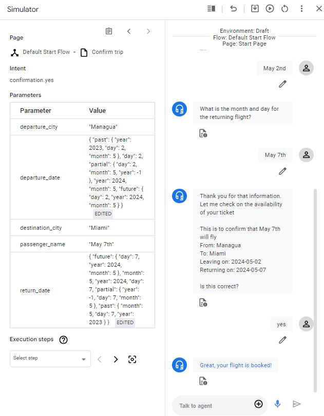

# Sample Dialogflow Agents Repository

Welcome to the Sample Dialogflow Agents repository! This repository contains a collection of sample Dialogflow agents showcasing various use cases. Each agent is designed to demonstrate different features and capabilities of Dialogflow.

## Flight Booker Agent

The Flight Booker agent is designed to assist users in booking flights. It utilizes Dialogflow's natural language understanding capabilities to parse user queries and extract relevant information such as departure and destination cities, dates, and preferences.

### Features:
- **Intent Recognition**: Recognizes user intents for booking flights, querying flight status, and managing bookings.
- **Entity Extraction**: Extracts entities such as departure city, destination city, departure date, and passenger preferences from user queries.
- **Fulfillment**: Integrates with backend systems to handle flight booking and reservation management.
- **Contextual Understanding**: Maintains context across conversations to provide a seamless booking experience.

### Usage:
To use the Flight Booker agent:
1. Import the agent zip file into your Dialogflow console.
2. Configure fulfillment webhook to handle flight booking requests.
3. Test the agent using the Dialogflow simulator or integrate it into your preferred platform.

### Screenshots:

## Contributing:
Contributions to this repository are welcome! If you have a sample Dialogflow agent that you would like to contribute, please fork this repository, add your agent, and submit a pull request.

## License:
This repository is licensed under the MIT License. See the [LICENSE](LICENSE) file for details.
